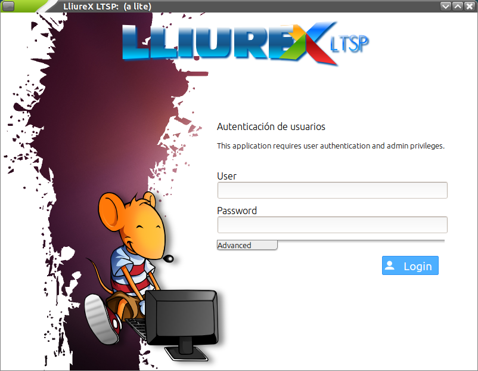
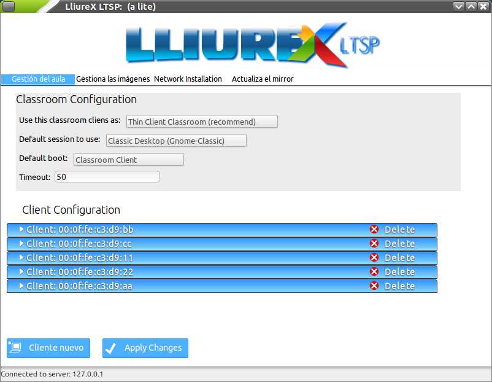
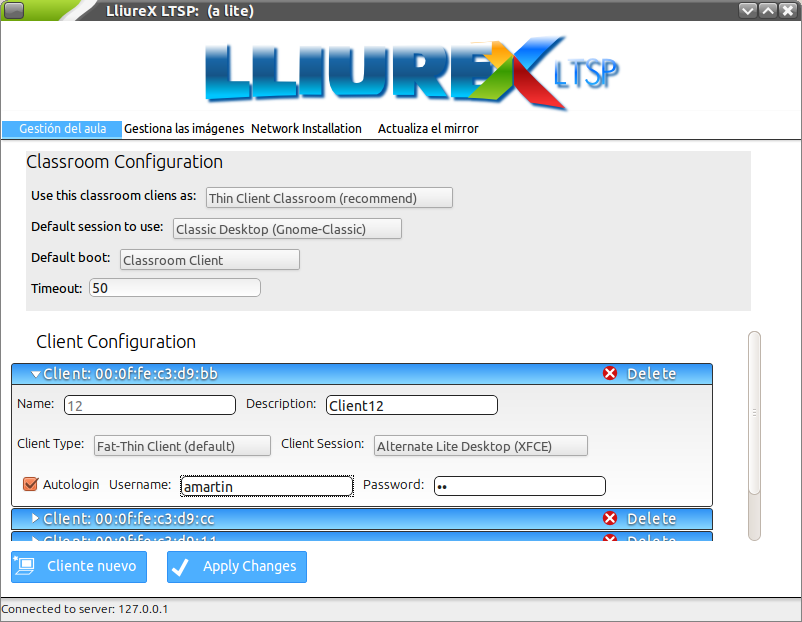
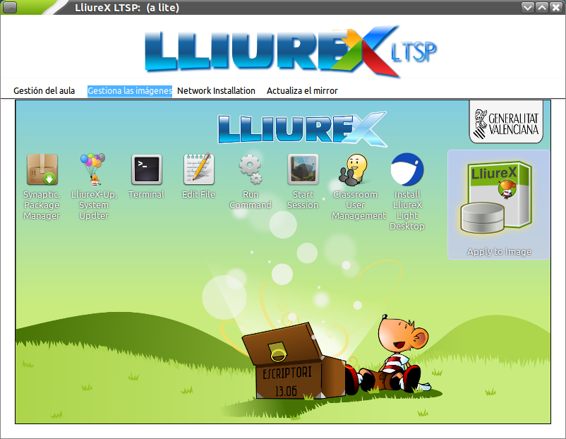
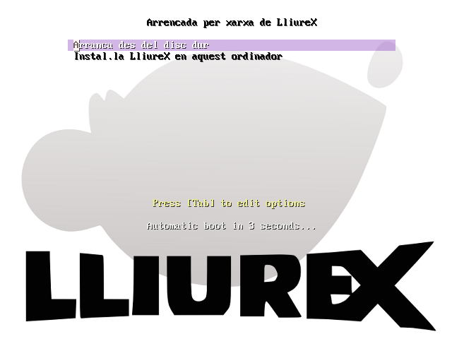
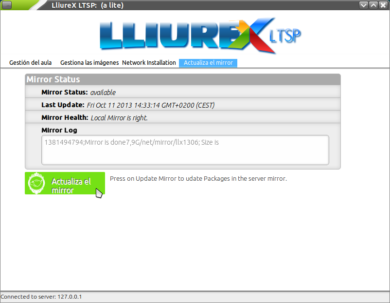

Configuración de LliureX LTSP
=============================

Conceptos básicos
-----------------

Aunque en ocasiones se hable de imágenes tanto para el directorio *chroot* como para el archivo imagen (*.img*), debe quedar claro que el primero es la versión manipulable (sin comprimir) del segundo (comprimido). Por lo tanto, cada vez que queramos alterar la imagen de los clientes, habrá que actuar sobre el directorio *chroot* para luego generar el archivo imagen.

Así pues, en LliureX LTSP disponemos de varias operaciones que nos permitirán gestionar las imágenes de los clientes ligeros y semi-ligeros:

* Instalar un sabor de LliureX en un directorio *chroot*.
* Personalizar una imagen sin comprimir (*chroot*).
* Exportar e importar directorios *chroot*.
* Borrar una imagen *chroot*.
* Configurar el aula (equipos cliente).
* Actualizar el repositorio de paquetes.
* Instalación por red.

.. note::
  Un *sabor* de LliureX es cualquiera de las diferentes opciones que tenemos para instalar: Escriptori, Infantil, Aula, etc. Empleamos dicho término para diferenciarlo de *versiones* de LliureX: 13.06 (Pandora), 12.06 (Nemo), 11.09 (Marty), etc.

Requisitos previos
------------------

Para la configuración de LliureX LTSP es **necesario** tener el servidor:

#. Instalado correctamente
#. Inicializado convenientemente
#. Con una copia del repositorio o repositorios de paquetes (mediante LliureX Mirror)
#. Actualizado (para incorporar las últimas correcciones y mejoras)

Puede acceder a LliureX LTSP desde el menú de *Administración de LliureX*, seleccionando *Gestor de LliureX LTSP*.

La pantalla de entrada es la siguiente:

Deberá introducir un usuario y contraseña con permisos de administración. Una vez validado se le presentará la siguiente ventana:

.. image:: _static/llx-ltsp-welcome.png
   :width: 500px

Desde ella podrá realizar las siguientes operaciones:

* Gestionar el aula (escogiendo las imágenes que arrancará cada cliente ligero o semiligero)
* Gestionar las imágenes de los clientes ligeros y semiligeros
* Instalar (por red) el aula
* Actualizar la copia del repositorio (*mirror*)

Configuración de los clientes ligeros
-------------------------------------

En la sección de *Gestión del aula* se pueden configurar los siguientes parámetros:

* Una sección para la configuración por defecto de toda el aula:

  * Escoger el tipo de cliente entre ligero y semi-ligero.
  * Sesión a usar por defecto.
  * Arranque por defecto.
  * Tiempo de expiración. 

* Otra sección para configurar clientes concretos, que permite configurar casos especiales (cuando tenemos un aula mixta con clientes ligeros y equipos normales, por ejemplo):

  * Nombre y descripcion.
  * Tipo de cliente (semi-ligero, por defecto)
  * Sesión (Gnome Classic o Entorno Alternativo con XFCE)
  * Autologin (con un usuario y contraseña suministrados)

* Para ir añadiendo clientes personalizados en la sección anterior hay que pulsar el botón de *Cliente nuevo*. 

.. important:: Para que toda configuración nueva tenga efecto será necesario aplicar los cambios con el botón *Aplicar*.

Gestión de las imágenes
-----------------------

LliureX LTSP permite la instalación, personalización, borrado, exportación e importación de imágenes de clientes ligeros.

.. image:: _static/llx-ltsp-images-mgmt.png
   :width: 500px

Veamos cada una de estas posibilidades con algo más de detalle.

Instalación de imágenes
-----------------------

El proceso de instalación de imágenes consiste en la construcción, en un directorio *chroot*, de un sabor de LliureX (Escriptori, Infantil, Aula, etc.) completo. Esto nos va a permitir la modificación, actualización y preparación para la generación del archivo imagen (*.img*) que será cargado por los clientes definidos.

Este proceso es laborioso y suele durar un mínimo de 2 horas. Sin embargo, esto sólo se debe realizar la primera vez. A partir de la creación de dicho directorio (con todos los paquetes necesarios) las modificaciones llevarán mucho menos tiempo.

Para agilizar este proceso se ha creado la posibilidad de guardar en un archivo comprimido estándar (*.tar.gz*) el contenido del directorio *chroot* seleccionado. Este proceso es el que denominamos *exportación* de imagen. Igualmente se puede importar uno de estos archivos para que LliureX LTSP lo descomprima en un directorio *chroot*. Igualmente llamaríamos a esto *importación* de una imagen.

Este procedimiento puede entenderse como una copia de seguridad y permite acortar el tiempo de instalación de imagen (pasamos de unas 2 horas a unos 15 minutos). Para ello deberemos partir de una imagen creada previamente. Desde la web de LliureX se pueden descargar directorios *chroot* comprimidos para agilizar dicho proceso. Actualmente la dirección es: http://releases.lliurex.net/isos/13.06/ltsp/

Así pues, el procedimiento más rápido sería:

* Descargarse una imagen de la anterior dirección web (o copiarla de un *pendrive*, disco externo, etc. donde ya tuviéramos la imagen descargada)
* Importarla mediante la opción de importación
* Personalizar la imagen (*chroot*) y aplicar los cambios (ver más adelante `Personalización de imágenes`_)

Cuando se importa una imagen, se deshabilita el botón de instalación (deja de ser necesario).
 
Personalización de imágenes
---------------------------

Para poder adaptar las imágenes a las necesidades concretas de cada aula se ofrece una herramienta (mediante el botón de *avanzado*) que permite actualizar, instalar, desinstalar y configurar cualquier aplicación como si fuera nuestra propia máquina. Como se puede apreciar en la captura de pantalla, disponemos de un escritorio virtual con iconos que dan paso a diferentes opciones: 

* Instalar paquetes con Synaptic
* Actualizar la imagen con LliureX Up
* Acceso a una terminal en el directorio *chroot*
* Editar un fichero de texto
* Ejecutar un comando
* Abrir una sesión
* Gestionar los usuarios
* Instalar una versión ligera del escritorio

Una vez hayamos acabado de realizar cambios, deberemos aplicar los cambios para que se regenere la *imagen*.

.. important::
  Los cambios realizados se aplican sobre el sistema *chroot* que tengamos en el correspondiente directorio, pero deberemos realizar el paso de aplicar los cambios para regenerar la imagen (*.img*) con la que trabajan los clientes. Si no aplicamos los cambios, aunque éstos radiquen en el directorio *chroot*, no serán visibles en los clientes.

.. hint::
  No es necesario aplicar los cambios a cada modificación que hagamos en el *chroot* hasta que deseemos que se apliquen. Por ejemplo, podemos actualizar el sistema con LliureX Up, y luego lanzar Synaptic e instalar nuevos paquetes. Cuando tengamos todos los cambios que deseemos, ya podemos regenerar el archivo *.img*.

Instalación (por red) del aula
------------------------------

Esta opción es la que deberá escoger cuando necesite instalar (como clientes normales) parte o toda el aula. Como puede comprobar en la captura de pantalla, se trata de *habilitar* la instalación por red y aplicar los cambios. A partir de ese momento podrá instalar desde el arranque por red (PXE) de los equipos cliente.

.. image:: _static/llx-ltsp-netinstall-enable.png
   :width: 500px

.. note::
  Para poder arrancar un equipo cliente por red es necesario que tenga habilitada la opción en la BIOS (PXE). Esta opción ya viene activada en los clientes ligeros pero no necesariamente en los equipos más antiguos que queramos usar como clientes ligeros.

En el equipo cliente se podrá observar el siguiente menú en el arranque:

Escoja la opción de instalar y aparecerá un nuevo menú con las posibles imágenes a instalar:

.. image:: _static/llx-ltsp-netinstall-PXE2.png
   :width: 500px

Mantenimiento del repositorio
-----------------------------

Desde esta sección puede actualizar el repositorio de paquetes de LliureX en el servidor del Aula. Insistimos en que la correcta actualización del repositorio es **fundamental** para el funcionamiento de LliureX LTSP.

.. hint::
  Si tiene un aula *mixta* (con clientes de 32 y 64 bits) recuerde marcar en *LliureX Mirror* la opción de ambos repositorios y poder disponer de los dos tipos de imágenes.
