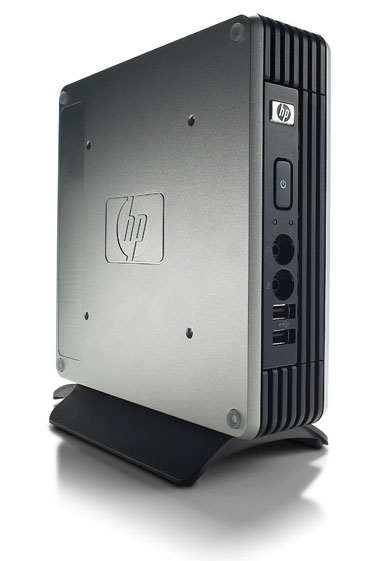
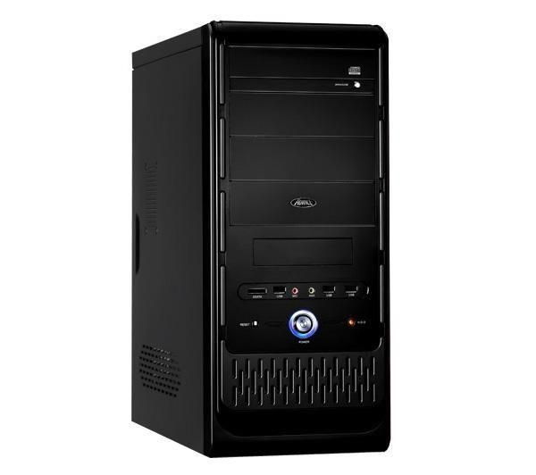

Introducción a LliureX LTSP
===========================

¿Qué es LliureX LTSP?
---------------------

LliureX LTSP es la adaptación del proyecto LTSP (`Linux Terminal Server Project <http://ltsp.org>`_) para el soporte de clientes ligeros en el modelo de Aula/Centro LliureX.

LTSP es un servidor de terminales libre y abierto para Linux que permite que varias personas utilicen el mismo ordenador. Las aplicaciones se ejecutan en el servidor con un terminal llamado cliente ligero. Generalmente los clientes ligeros tienen un consumo reducido de energía, no disponen de disco duro y son más silenciosos y fiables que los ordenadores normales (al no tener partes móviles).

   
De la misma manera, ordenadores que podrían llegar a ser obsoletos se pueden reciclar en clientes ligeros. Extendiendo la vida útil de estos ordenadores también se reducen costes.

Por último, el hecho de que todos los clientes ligeros arranquen la misma imagen reduce drásticamente el mantenimiento de la configuración. Por ejemplo, en lugar de actualizar todos los equipos, sólo actualizamos una imagen que se cargará en todos.

¿Qué funcionalidad ofrece LliureX LTSP?
---------------------------------------

Un servidor LliureX (bien de Aula, bien de Centro o Independiente) debe disponer de una copia (*mirror*) del repositorio de paquetes de LliureX para su correcto mantenimiento. A partir de dicho repositorio local se pueden generar las imágenes de *cualquiera* de los sabores de LliureX. Igualmente se pueden actualizar y personalizar (instalar/eliminar programas, editar la configuración del escritorio, etc) dichas imágenes.

Adicionalmente existe la posibilidad de configurar clientes "*semi-ligeros*" (también llamados "*fat clients*", por contraste con "*thin client*"). Un cliente semi-ligero utiliza la misma imagen generada en el servidor pero con la diferencia de utilizar la CPU y la memoria RAM del equipo cliente. De esta manera, los equipos cliente que tengan la potencia suficiente podrán descargar de trabajo (uso de recursos) al servidor.

Otra opción interesante es la posibilidad de realizar la instalación de equipos cliente (tradicionales) por red. Aunque esta funcionalidad no es propia de LTSP, se ha aprovechado la infraestructura necesaria para LTSP (repositorio local) y ofrecer la instalación por red vía la interfaz de gestión de LliureX LTSP. Dependiendo de la capacidad de la red del aula (o del centro) se podrán realizar más (o menos) instalaciones simultáneas de clientes. Esta utilidad ayuda a reducir el tiempo de instalación total.

Requisitos de funcionamiento
----------------------------

Según la documentación del proyecto LTSP y de Ubuntu, los requisitos mínimos en el servidor son:

* Core 2 Duo o Core 2 Quad (también funciona con CPUs más simples pero con menor rendimiento).
* 4 GB (20 clientes); recomendable 8 GB (depende de la demanda de los usuarios).
* 1 tarjeta de red a Gigabit (mínimo).

En el cliente:

* Pentium Pro o superior.
* 128 MB de RAM.
* Tarjeta de red Fast Ethernet con soporte PXE.

Conceptos básicos
-----------------

Los conceptos principales a tener en cuenta son:

Directorio *chroot*
    Directorio con el contenido *completo* de un *sabor* de LliureX. Este directorio se construye a partir del repositorio de paquetes local del servidor. En él se pueden instalar/desinstalar aplicaciones, realizar actualizaciones, etc. A partir de los contenidos de este directorio se generará el archivo *imagen* correspondiente. Este es un proceso costoso y suele tardar alrededor de 2 horas. No obstante no es una operación a realizar con frecuencia puesto que, una vez generado, el mantenimiento este directorio es mucho más ligero (las operaciones de instalar/desinstalar y actualizar son más cortas).

Archivo *imagen* (*.img*)
    Fichero *imagen* generado a partir de un directorio *chroot* concreto. Este fichero imagen será enviado por red al equipo cliente (tanto ligero como semi-ligero). El proceso de    generación suele tardar alrededor de unos 15 minutos.

Cliente ligero
    Como ya se ha explicado antes, se trata de un equipo de bajas prestaciones pero suficiente para poder mostrar la imagen de la sesión en el servidor en la pantalla. Tanto los procesos de cálculo como el almacenamiento en memoria se producen en el servidor. Es barato (fácil de reemplazar) y también reduce el tiempo de administración (todos los clientes ligeros tienen -o suelen tener por defecto- la misma imagen o configuración).

Cliente semi-ligero (*fat-thinclient*)
    Por contra, un cliente semiligero necesita un poco más de recursos dado que el procesamiento y la memoria son locales (pero sigue sin necesitar disco duro). Utiliza menos recursos del servidor (permitiendo más clientes para el mismo *hardware* si lo comparamos con los clientes ligeros normales).

.. note::

  Un *chroot* es básicamente un directorio especial de tu ordenador que evita que las aplicaciones puedan acceder a ficheros de fuera de ese directorio. En muchos sentidos, un *chroot* es como instalar un sistema operativo dentro del sistema operativo existente. Más información en: http://help.ubuntu.com/community/BasicChroot

Motivos para el cambio de TCOS a LTSP
-------------------------------------

LliureX LTSP se introduce en la versión 13.06 (Pandora) motivado por varias razones:

* Mayor comunidad de usuarios y desarrolladores (con todo lo que ello implica).
* Gestión más flexible en la generación de imágenes de los clientes.
* Mejor rendimiento (de NBD comparado con NFS).

